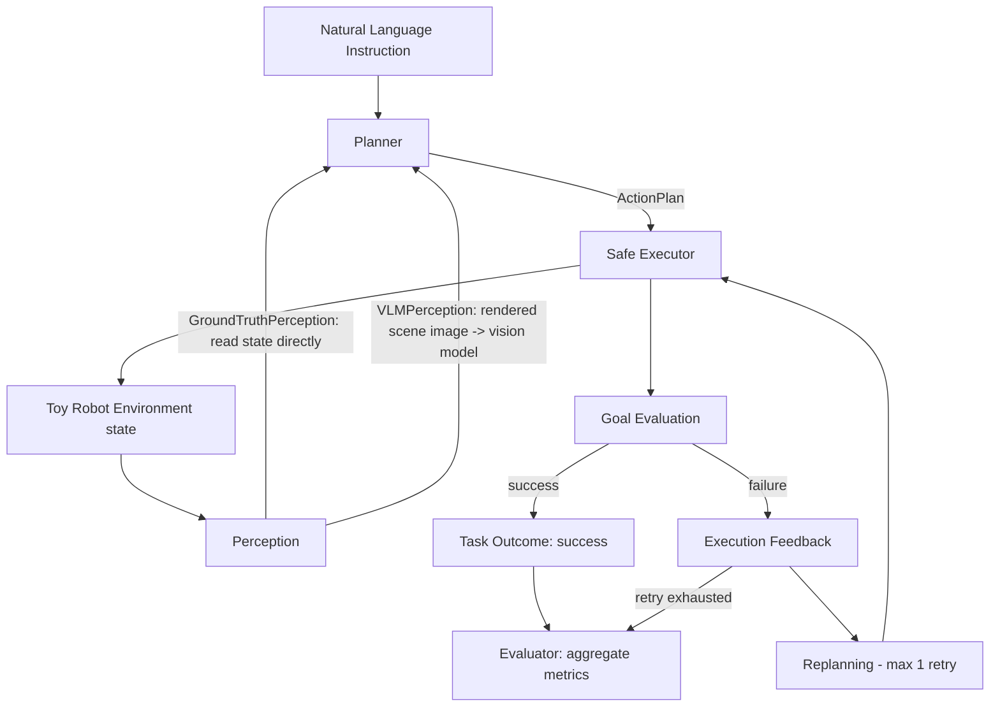

# Architecture

## Data flow

## Layers

| Layer | Module | Responsibility |
|---|---|---|
| Models | `geniac_cap.models` | Pydantic models shared by every layer (Action, ActionPlan, TaskDefinition, ExecutionResult, EvaluationSummary) |
| Environment | `geniac_cap.environment` | Pure-Python 2D-ish toy world: robot, objects, locations, constraints, goal checking |
| Tasks | `geniac_cap.tasks` | Loads task definitions from YAML; no task is hardcoded in Python |
| Perception | `geniac_cap.perception` | Turns environment state into a `PlanningContext`. `GroundTruthPerception` reads state directly (default); `VLMPerception` renders the scene as a PNG and asks a vision-capable LLM to describe it instead (Phase 4) |
| Planners | `geniac_cap.planners` | Turns an instruction + `PlanningContext` into an `ActionPlan`. `BasePlanner` is the extension point for future LLM-backed planners |
| Execution | `geniac_cap.execution` | `SafeExecutor` runs a plan against the environment using a **whitelist** of allowed actions; validates arguments; enforces a max step count |
| Evaluation | `geniac_cap.evaluation` | Runs many tasks through a planner, aggregates metrics, saves JSON/CSV |
| CLI | `geniac_cap.cli` | Typer commands wiring the above together for interactive use |

## Why no `exec()` / `eval()`

The Executor never runs arbitrary generated code. A Planner can only ever
produce a list of `Action` objects, each of which is validated against a
fixed whitelist (`execution/validation.py`) before the corresponding
`ToyRobotEnv` method is called. This keeps the current version safe by
construction, while leaving `CodeParser` / `SafeCodeExecutor` as clearly
marked *interface stubs* for a possible future phase where code-generation
policies are explored (see `docs/roadmap.md`, Phase 5+). Those stubs raise
`NotImplementedError` today and are not reachable from any CLI command.

## Extension points

- `BasePlanner` — add `OpenAIPlanner`, `AnthropicPlanner`, `LocalModelPlanner`
  without touching the Executor, Evaluator, or CLI.
- `ToyRobotEnv` — the same public method names (`move_to`, `pick`, `place`,
  ...) could later be backed by MuJoCo/Isaac Sim/ROS instead of the current
  in-memory dict-based state, without changing Planners or the Executor.
- `FeedbackPlanner.replan()` — currently a rule-based repair; could be
  replaced by a multi-turn LLM agent that reads the same structured
  feedback text.
